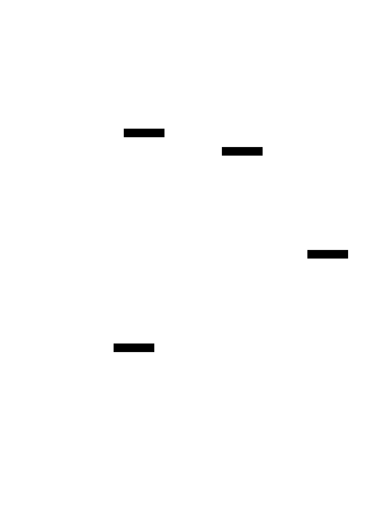

# fm-robot

[](LICENSE)

Robot layer for First Motive's ROS2 stack. Groups the URDF description, the
`ros2_control` controllers, and the sensor drivers — the packages that describe
and drive the physical robot.

Part of First Motive's ROS2 (Humble) stack. Builds standalone here; assembled
with the other six package repos by
[`fm-ros2`](https://github.com/first-motive/fm-ros2).

## Packages

| Package | Build | Role |
|---------|-------|------|
| `fm_description` | ament_cmake | URDF/xacro, meshes, and Foxglove layouts for the robot |
| `fm_control` | ament_cmake | `ros2_control` controllers and hardware wiring |
| `fm_sensors` | ament_python | Sensor drivers |
| `fm_robot` | ament_cmake | Metapackage tying the three together for a single install |

## Standalone Build

Clone into a colcon workspace's `src/`, pull dependencies, then build:

```bash
mkdir -p ws/src && cd ws/src
git clone https://github.com/first-motive/fm-robot.git
vcs import < fm-robot/fm-robot.repos     # externals (OpenArm + Unitree descriptions)
cd .. && colcon build --symlink-install
colcon test && colcon test-result --verbose
```

## Run

`run.sh` is the standalone front door: it builds the workspace and launches a
robot description view that Foxglove Studio renders at `ws://localhost:8765`. The
host OS picks the path, overridable with `--native` / `--container`:

```text
Linux  -> native     build + launch on the host (needs ROS2 Humble installed)
Darwin -> container  build the fm-robot image, run it via the fm-docker overlays
```

```bash
./run.sh                     # auto-detect, default robot (g1_d)
./run.sh --robot so101       # pick a robot (hyphen or underscore form)
./run.sh --robot openarm use_rviz:=true   # extra args pass through to ros2 launch
```

The container path imports the shared compose overlays from
[`fm-docker`](https://github.com/first-motive/fm-docker) into `docker/` (via
`fm-robot.repos`) and builds this repo's `Dockerfile`, which is `FROM` the
`fm-docker` base. Tear down the container with
`docker compose -f docker/compose.yaml -f docker/compose.macos.yaml down`.

## Architecture

Three concerns stack one on the next: `fm_description` is the foundation,
`fm_control` adds the control layer, and the hardware abstraction lets the same
control stack drive a mock, three simulators, or real hardware behind one
`ros2_control` interface.



System overview and the design contract: [docs/ARCHITECTURE.md](docs/ARCHITECTURE.md).
Per-layer detail and diagrams live in each package's README.

## Governance

Owner-free-on-main — see [CONTRIBUTING.md](CONTRIBUTING.md) and
[`.github/CODEOWNERS`](.github/CODEOWNERS).
